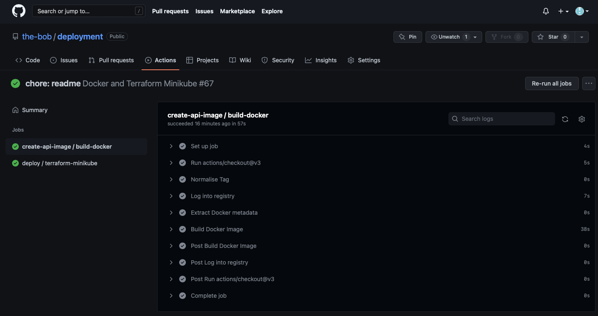
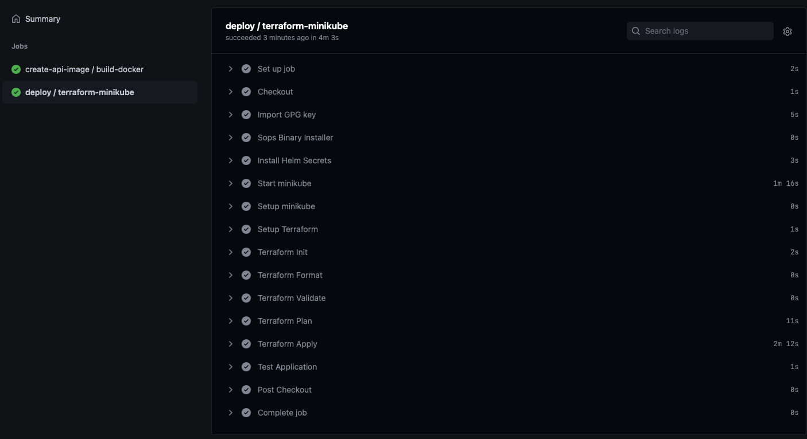

# deployment terraform

Simple Deployment for Kubernetes. This project utilises:

* [Helm](https://helm.sh/)
* [Chart Museum (Github Hosted)](https://helm.sh/docs/topics/chart_repository/)
* [Github Container Registry](https://docs.github.com/en/packages/working-with-a-github-packages-registry/working-with-the-container-registry)
* [Github Actions with Reusable Workflows for the CI and CD](https://github.com/features/actions?utm_source=google&utm_medium=ppc&utm_campaign=2022q3-adv-WW-Google_Search-eg_brand&scid=7013o000002CdxYAAS&gclid=CjwKCAjw9-KTBhBcEiwAr19igwDOC5H1dZTOEWstj1TQeaD1b_N4UXRUr1Grmj8WGL_y5xkHc7C_RBoC-KQQAvD_BwE)
* [Terraform](https://www.terraform.io/)
* [Sops](https://github.com/mozilla/sops) and [GPG](https://gnupg.org/) for Encryption


# Prerequisites

Softwares required: 

| Software   | Version |
|-------------|-------------|
| helm | v3.8.2 |
| helm-secrets | `helm plugin install https://github.com/jkroepke/helm-secrets` |
| sops | 3.7.2 |
| terraform | 1.1.8 |
| minikube | v1.25.2 |
| gpg | 2.3.6 |
| kubectl | v1.22.5 |

# Repository Structure and Dependencies

## Directory

This is currently setup as a mono-repo where

| Directory   | Description |
|-------------|-------------|
| api | This is where the backened code is, This builds the `FastAPI` Docker image and currently publishes to [Github Container Registry](https://github.com/the-bob/deployment/pkgs/container/fast-api) <br> |
| tf-deployment | This calls out to the [Terraform Helm Module](https://github.com/the-bob/helm-module) which uses the OOTB Helm Module, The aim for this is to simplify the usage of the module etc <br> as part of the CI/CD it is being deployed in `github actions` with `minikube` |
| .github/workflows | This Project runs a CI/CD in github workflows by spinning up a `minikube` cluster and deploying these via `helm` through `terraform`, see [Github Action](https://github.com/the-bob/deployment/actions)<br><br> API Docker Build <br><br><br> Terraform CI and CD <br>|
| gpg | this is where the encryption keys are located |


```sh
.
├── .github
│   └── workflows
├── LICENSE
├── README.md
├── api
│   ├── Dockerfile
│   ├── app
│   └── requirements.txt
├── gpg
│   ├── helm.asc
│   └── helm.pub
├── tf-deployment
│   ├── charts
│   ├── data.tf
│   ├── main.tf
│   ├── variables.tf
│   └── versions.tf

```

## Services Directory (Charts) | tf-deployment/charts

This Dir contains the `values` and `secrets` file used for `helm`

```sh
.
├── api
│   ├── secrets.yaml
│   └── values.yaml
├── argocd
│   └── values.yaml
├── datadog
│   ├── secrets.yaml
│   └── values.yaml
└── mariadb
    └── secrets.yaml
```


## Dependent Projects and Repositories

This calls out to the different Projects, Repositories, Registries and Chartmuseum, and Yes i've set them all up (well .. mostly) :)

| Name | Description | Location | CI/CD |
|-|-|-|-|
|Helm Chart (api)| This Contains the Chart template used for the `api` used | <br> [Charts](https://github.com/the-bob/chartmuseum/tree/main/charts) <br> [Published Charts](https://the-bob.github.io/chartmuseum/index.yaml)| [CI/CD](https://github.com/the-bob/chartmuseum/actions) |
| Terraform Helm Module | This Project Contains the Terraform Helm Module terraform-module/release/helm, <br>This allows to make the usage of the module more controlled and easily manageable, <br>especially if it's going to be used with (n) environments etc.<br> it also automatically generates the needed `terraform-docs`| [Terraform Module](https://github.com/the-bob/helm-module) | [CI/CD](https://github.com/the-bob/helm-module/actions) |
| Github Container Registry | This is where the published docker images reside from the `api` | [API Github Container Registry](https://github.com/the-bob/deployment/pkgs/container/fast-api) | |
| Chart Museum | This is a self-hosted Chart Museum in Github | [Chart Museum](https://github.com/the-bob/chartmuseum)<br> [Charts](https://the-bob.github.io/chartmuseum/index.yaml)| [CI/CD](https://github.com/the-bob/chartmuseum/actions) |


# Services Deployed

* [Ingress-Nginx](https://github.com/kubernetes/ingress-nginx)
* [Datadog](https://github.com/DataDog/helm-charts)
* [MariaDB](https://github.com/helm/charts/tree/master/stable/mariadb)
* [ArgoCD](https://github.com/argoproj/argo-helm/tree/master/charts/argo-cd)
* API
    * Configurations are set in the `tf-deployment/charts/api/`
    * Ingress Enabled with Nginx to wire-up with the ingress-nginx controller
    * Configmap are set in the `values.yaml` - but can be on a separate `configmap.yaml`
    ```yaml
    config:
        values: 
            key: pair
    ```
    * Secrets `secrets.yaml` - encrypted via GPG
    * Auto-Scalling
    ```yaml
    autoscaling:
        enabled: true
        targetCPUUtilizationPercentage: 90
        targetMemoryUtilizationPercentage: 90
        maxReplicas: 5
        minReplicas: 2
    ```

# Running Locally

This describes how to deploy the applications via running this tool locally with a `minikube` kubernetes cluster.

## Import GPG

Included in this project is the gpg encryption keys in order to decrypt the `sops` files.

* Navigate to the gpg dir 
```sh
gpg --import helm.asc
```

## Deploy the applications | Run the Tool

*Note: Datadog will fail as we need to provide the api and app keys*

* Make sure you have a clean `minikube` Cluster, if there's pre-existing setup just simply run

```sh
minikube delete
# Paranoid Scenario
ps -ef | grep minikube | awk '{print $2}' | xargs kill -9
```
* Navigate to the tf-deployment dir and Initialize Terraform
```sh
terraform init
```
* Setup the plan to see any changes
```sh
terraform plan
```

* Apply
```sh
terraform apply
```

* To Access via localhost
    * run `minikube tunnel` on a separate terminal
    * get url 
        * `minikube service --url ingress-nginx-controller` and copy & paste the output to the browser OR
        * `kubectl get svc | grep ingress-nginx-controller | grep -v '<none>' | awk '{print $4}'` and copy & and copy & paste the output to the browser

* To Clean 
```sh
# Brute Force 
minikube delete
# Paranoid Scenario
ps -ef | grep minikube | awk '{print $2}' | xargs kill -9
```
<br>
<hr>

# Bob's Note: Secrets Management

This mini project uses `sops` with GPG to encrypt the files with sensitive informations such as `passwords`, `secret keys` etc.
Ideally should be `vault` or `Secrets Manager (AWS)` or something similar.

* gpg --gen-key
* gpg --list-secret-keys --keyid-format LONG <EMAIL>
* gpg --list-key 3EC025ACEA7CE99F

* sops -e --in-place -pgp 3EC025ACEA7CE99F secrets.yaml

Export

* gpg --export --armor <EMAIL> > helm.pub
* gpg --keyserver keyserver.ubuntu.com --send-key 3EC025ACEA7CE99F
* gpg --export-secret-key -a <EMAIL> > helm.asc

Import

* gpg --import helm.asc